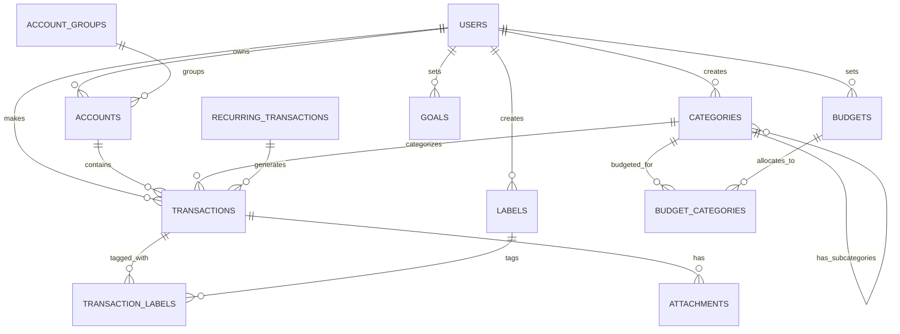

# Product Requirements Document - Personal Finance Management Application

## Executive Summary

This document defines the complete requirements for building a personal finance management application similar to BudgetBakers. The application will use a monolithic architecture with clear REST API separation to enable future backend flexibility. It will be built using the latest Next.js 15+ with PostgreSQL database.

---

## Table of Contents

1. [Product Overview](#product-overview)
2. [Technical Architecture](#technical-architecture)
3. [Functional Requirements](#functional-requirements)
4. [Non-Functional Requirements](#non-functional-requirements)
5. [Database Design](#database-design)
6. [API Design](#api-design)
7. [Frontend Architecture](#frontend-architecture)
8. [Database Migration Strategy](#database-migration-strategy)
9. [Database Seeder Specifications](#database-seeder-specifications)
10. [Testing Strategy](#testing-strategy)
11. [Technology Stack & Libraries](#technology-stack--libraries)
12. [Security Requirements](#security-requirements)
13. [Performance Requirements](#performance-requirements)
14. [Deployment Strategy](#deployment-strategy)

---

## 1. Product Overview

### 1.1 Vision
Build a comprehensive personal finance management system that helps users track expenses, manage budgets, analyze spending patterns, and achieve financial goals.

### 1.2 Core Value Propositions
- **Comprehensive Tracking**: Track all financial activities in one place
- **Multi-Account Management**: Support multiple bank accounts, cash, credit cards
- **Smart Categorization**: Hierarchical categories with automatic suggestions
- **Budget Management**: Set and track budgets with alerts
- **Visual Analytics**: Charts and reports for spending insights
- **Multi-Currency Support**: Handle transactions in different currencies
- **Data Security**: Bank-level security for financial data
- **Cross-Platform**: Works on desktop, tablet, and mobile devices

### 1.3 Target Users
- Individual users managing personal finances
- Families tracking household expenses
- Freelancers managing business and personal accounts
- Small business owners tracking simple business finances

---

## 2. Technical Architecture

### 2.1 Architecture Pattern
**Monolithic Application with API-First Design**

```
┌─────────────────────────────────────────────────────────┐
│                     Next.js Application                   │
├─────────────────────────────────────────────────────────┤
│                                                           │
│  ┌──────────────────┐        ┌──────────────────┐      │
│  │                  │        │                  │      │
│  │  Frontend Layer  │  REST  │   Backend API    │      │
│  │   (Next.js UI)   │  ←───→ │  (API Routes)    │      │
│  │                  │        │                  │      │
│  └──────────────────┘        └──────────────────┘      │
│                                      ↓                   │
│                              ┌──────────────────┐      │
│                              │   Service Layer  │      │
│                              └──────────────────┘      │
│                                      ↓                   │
│                              ┌──────────────────┐      │
│                              │  Database Layer  │      │
│                              │   (Prisma ORM)   │      │
│                              └──────────────────┘      │
└─────────────────────────────────────────────────────────┘
                                      ↓
                          ┌──────────────────┐
                          │   PostgreSQL DB   │
                          └──────────────────┘
```

### 2.2 Key Design Principles

1. **API-First Design**: All frontend-backend communication via REST APIs
2. **Stateless Backend**: No server-side sessions, JWT-based authentication
3. **Separation of Concerns**: Clear boundaries between layers
4. **Database Agnostic**: ORM abstraction for database portability
5. **Type Safety**: End-to-end TypeScript for type safety
6. **Security by Design**: Authentication, authorization, and data validation at every layer

### 2.3 Folder Structure

```
finance-app/
├── app/                       # Next.js App Router
│   ├── (auth)/               # Authentication pages
│   │   ├── login/
│   │   ├── register/
│   │   └── forgot-password/
│   ├── (dashboard)/          # Protected dashboard pages
│   │   ├── layout.tsx
│   │   ├── page.tsx
│   │   ├── accounts/
│   │   ├── transactions/
│   │   ├── budgets/
│   │   ├── analytics/
│   │   ├── categories/
│   │   └── settings/
│   └── api/                  # REST API endpoints
│       └── v1/
│           ├── auth/
│           ├── accounts/
│           ├── transactions/
│           ├── categories/
│           ├── budgets/
│           ├── analytics/
│           └── ...
├── components/               # Reusable React components
├── lib/                      # Core business logic
│   ├── api/                 # API client utilities
│   ├── auth/                # Authentication logic
│   ├── db/                  # Database utilities
│   ├── services/            # Service layer
│   └── validation/          # Validation schemas
├── prisma/                   # Database schema and migrations
├── public/                   # Static assets
├── styles/                   # Global styles
├── tests/                    # Test files
├── types/                    # TypeScript type definitions
└── utils/                    # Utility functions
```

---

## 3. Functional Requirements

### 3.1 User Management

#### 3.1.1 Registration & Authentication
- **Email/Username Registration**: Users can register with email and username
- **Secure Password**: Minimum 8 characters, mixed case, numbers, special characters
- **Email Verification**: Optional email verification for account activation
- **JWT Authentication**: Stateless authentication using access and refresh tokens
- **Password Recovery**: Reset password via email link
- **Two-Factor Authentication**: Optional 2FA using TOTP
- **Social Login**: OAuth integration (Google, Apple, Microsoft)

#### 3.1.2 User Profile
- **Profile Information**: Name, email, avatar, timezone, currency preference
- **Account Settings**: Language, date format, number format
- **Privacy Settings**: Data export, account deletion
- **Notification Preferences**: Email, push, in-app notifications

### 3.2 Account Management

#### 3.2.1 Account Types
- **Bank Accounts**: Checking, savings, investment accounts
- **Cash**: Physical cash tracking
- **Credit Cards**: Credit card accounts with credit limits
- **Digital Wallets**: PayPal, Venmo, crypto wallets
- **Investment Accounts**: Stocks, bonds, mutual funds
- **Loan Accounts**: Mortgages, personal loans, auto loans

#### 3.2.2 Account Features
- **Initial Balance**: Set opening balance
- **Multi-Currency**: Support different currencies per account
- **Account Groups**: Group related accounts
- **Archiving**: Archive inactive accounts
- **Icons & Colors**: Visual customization
- **Balance Tracking**: Real-time balance calculation
- **Interest Tracking**: For savings and loan accounts

### 3.3 Transaction Management

#### 3.3.1 Transaction Types
- **Income**: Salary, investments, gifts, refunds
- **Expenses**: Purchases, bills, subscriptions
- **Transfers**: Between accounts
- **Adjustments**: Balance corrections

#### 3.3.2 Transaction Features
- **Categorization**: Assign to categories/subcategories
- **Labels/Tags**: Multiple tags per transaction
- **Attachments**: Receipt images, documents
- **Recurring Transactions**: Automatic recurring entries
- **Split Transactions**: Split among multiple categories
- **Bulk Operations**: Edit/delete multiple transactions
- **Search & Filter**: Advanced search capabilities
- **Import/Export**: CSV, OFX, QIF formats
- **Duplicate Detection**: Identify potential duplicates

### 3.4 Category Management

#### 3.4.1 Category Structure
- **Hierarchical Categories**: Parent and child categories
- **Income Categories**: Salary, business, investments
- **Expense Categories**: Food, transport, utilities, entertainment
- **Custom Categories**: User-defined categories
- **Category Icons**: Visual icons for quick identification
- **Category Colors**: Color coding for reports
- **Category Rules**: Auto-categorization rules

#### 3.4.2 Category Features
- **Budget Assignment**: Link categories to budgets
- **Merge Categories**: Combine similar categories
- **Category Analytics**: Spending trends per category
- **Category Limits**: Set spending limits

### 3.5 Budget Management

#### 3.5.1 Budget Types
- **Category Budgets**: Budget per spending category
- **Total Budget**: Overall monthly/yearly budget
- **Project Budgets**: Special purpose budgets
- **Envelope Budgets**: Zero-based budgeting

#### 3.5.2 Budget Features
- **Budget Periods**: Monthly, quarterly, yearly
- **Budget Alerts**: Notifications at thresholds (50%, 80%, 100%)
- **Budget Rollover**: Carry over unused budget
- **Budget History**: Track budget performance over time
- **Budget Forecasting**: Predict future spending
- **Budget Reports**: Visual budget vs actual reports

### 3.6 Analytics & Reporting

#### 3.6.1 Dashboard
- **Account Overview**: All account balances
- **Recent Transactions**: Latest activity
- **Budget Status**: Current budget utilization
- **Spending Trends**: Monthly trends
- **Net Worth**: Total assets minus liabilities
- **Cash Flow**: Income vs expenses
- **Upcoming Bills**: Scheduled payments

#### 3.6.2 Reports
- **Income/Expense Report**: Detailed P&L statement
- **Category Report**: Spending by category
- **Trend Analysis**: Historical trends with predictions
- **Comparison Reports**: Month-over-month, year-over-year
- **Tax Reports**: Tax-related transaction summary
- **Custom Reports**: User-defined report templates

#### 3.6.3 Visualizations
- **Pie Charts**: Category distribution
- **Bar Charts**: Monthly comparisons
- **Line Charts**: Trend analysis
- **Heatmaps**: Spending patterns
- **Sankey Diagrams**: Cash flow visualization

### 3.7 Additional Features

#### 3.7.1 Goals & Savings
- **Financial Goals**: Set and track savings goals
- **Goal Progress**: Visual progress tracking
- **Auto-Save Rules**: Automatic transfers to savings

#### 3.7.2 Bills & Subscriptions
- **Bill Tracking**: Track recurring bills
- **Subscription Management**: Monitor subscriptions
- **Payment Reminders**: Bill due date alerts

#### 3.7.3 Debt Management
- **Loan Tracking**: Track loan balances and payments
- **Payment Schedules**: Amortization schedules
- **Debt Snowball/Avalanche**: Debt payoff strategies

---

## 4. Non-Functional Requirements

### 4.1 Performance
- **Page Load Time**: < 2 seconds on 3G
- **API Response Time**: < 200ms for read operations
- **Concurrent Users**: Support 10,000+ concurrent users
- **Data Processing**: Handle 1M+ transactions per user

### 4.2 Scalability
- **Horizontal Scaling**: Stateless architecture for easy scaling
- **Database Scaling**: Read replicas and connection pooling
- **Caching Strategy**: Redis for session and data caching

### 4.3 Availability
- **Uptime**: 99.9% availability
- **Disaster Recovery**: Automated backups and recovery
- **Geographic Distribution**: CDN for static assets

### 4.4 Security
- **Data Encryption**: AES-256 for data at rest
- **Transport Security**: TLS 1.3 for data in transit
- **OWASP Compliance**: Follow OWASP security guidelines
- **PCI DSS**: If handling credit card data

### 4.5 Usability
- **Responsive Design**: Works on all screen sizes
- **Accessibility**: WCAG 2.1 AA compliance
- **Internationalization**: Support multiple languages
- **Offline Support**: Basic offline functionality

---

## 5. Database Design

### 5.1 Database Schema

```sql
-- Users table
CREATE TABLE users (
    id UUID PRIMARY KEY DEFAULT gen_random_uuid(),
    email VARCHAR(255) UNIQUE NOT NULL,
    username VARCHAR(100) UNIQUE NOT NULL,
    password_hash VARCHAR(255) NOT NULL,
    full_name VARCHAR(255),
    avatar_url VARCHAR(500),
    email_verified BOOLEAN DEFAULT false,
    two_factor_enabled BOOLEAN DEFAULT false,
    two_factor_secret VARCHAR(255),
    timezone VARCHAR(50) DEFAULT 'UTC',
    currency VARCHAR(3) DEFAULT 'USD',
    date_format VARCHAR(20) DEFAULT 'YYYY-MM-DD',
    number_format VARCHAR(20) DEFAULT '1,234.56',
    created_at TIMESTAMP DEFAULT CURRENT_TIMESTAMP,
    updated_at TIMESTAMP DEFAULT CURRENT_TIMESTAMP,
    deleted_at TIMESTAMP
);

-- Account Groups
CREATE TABLE account_groups (
    id UUID PRIMARY KEY DEFAULT gen_random_uuid(),
    user_id UUID REFERENCES users(id) ON DELETE CASCADE,
    name VARCHAR(100) NOT NULL,
    icon VARCHAR(50),
    color VARCHAR(7),
    position INTEGER NOT NULL,
    created_at TIMESTAMP DEFAULT CURRENT_TIMESTAMP,
    updated_at TIMESTAMP DEFAULT CURRENT_TIMESTAMP
);

-- Accounts table
CREATE TABLE accounts (
    id UUID PRIMARY KEY DEFAULT gen_random_uuid(),
    user_id UUID REFERENCES users(id) ON DELETE CASCADE,
    group_id UUID REFERENCES account_groups(id) ON DELETE SET NULL,
    name VARCHAR(100) NOT NULL,
    account_type VARCHAR(50) NOT NULL, -- checking, savings, credit_card, cash, investment, loan
    currency VARCHAR(3) NOT NULL DEFAULT 'USD',
    initial_balance DECIMAL(15,2) DEFAULT 0,
    current_balance DECIMAL(15,2) DEFAULT 0,
    credit_limit DECIMAL(15,2), -- for credit cards
    interest_rate DECIMAL(5,2), -- for savings/loans
    icon VARCHAR(50),
    color VARCHAR(7),
    is_active BOOLEAN DEFAULT true,
    is_included_in_total BOOLEAN DEFAULT true,
    position INTEGER NOT NULL,
    created_at TIMESTAMP DEFAULT CURRENT_TIMESTAMP,
    updated_at TIMESTAMP DEFAULT CURRENT_TIMESTAMP,
    deleted_at TIMESTAMP
);

-- Categories table (hierarchical)
CREATE TABLE categories (
    id UUID PRIMARY KEY DEFAULT gen_random_uuid(),
    user_id UUID REFERENCES users(id) ON DELETE CASCADE,
    parent_id UUID REFERENCES categories(id) ON DELETE CASCADE,
    name VARCHAR(100) NOT NULL,
    type VARCHAR(20) NOT NULL, -- income, expense, transfer
    icon VARCHAR(50),
    color VARCHAR(7),
    is_system BOOLEAN DEFAULT false, -- system-provided categories
    is_active BOOLEAN DEFAULT true,
    position INTEGER NOT NULL,
    created_at TIMESTAMP DEFAULT CURRENT_TIMESTAMP,
    updated_at TIMESTAMP DEFAULT CURRENT_TIMESTAMP
);

-- Transactions table
CREATE TABLE transactions (
    id UUID PRIMARY KEY DEFAULT gen_random_uuid(),
    user_id UUID REFERENCES users(id) ON DELETE CASCADE,
    account_id UUID REFERENCES accounts(id) ON DELETE CASCADE,
    category_id UUID REFERENCES categories(id) ON DELETE SET NULL,
    type VARCHAR(20) NOT NULL, -- income, expense, transfer_in, transfer_out
    amount DECIMAL(15,2) NOT NULL,
    currency VARCHAR(3) NOT NULL,
    exchange_rate DECIMAL(10,6) DEFAULT 1,
    date DATE NOT NULL,
    description TEXT,
    payee VARCHAR(255),
    payment_method VARCHAR(50), -- cash, card, bank_transfer, etc.
    reference_number VARCHAR(100),
    is_recurring BOOLEAN DEFAULT false,
    recurring_id UUID REFERENCES recurring_transactions(id) ON DELETE SET NULL,
    transfer_id UUID, -- links transfer transactions
    created_at TIMESTAMP DEFAULT CURRENT_TIMESTAMP,
    updated_at TIMESTAMP DEFAULT CURRENT_TIMESTAMP,
    deleted_at TIMESTAMP
);

-- Create indexes for performance
CREATE INDEX idx_transactions_user_date ON transactions(user_id, date DESC);
CREATE INDEX idx_transactions_account ON transactions(account_id);
CREATE INDEX idx_transactions_category ON transactions(category_id);

-- Labels/Tags table
CREATE TABLE labels (
    id UUID PRIMARY KEY DEFAULT gen_random_uuid(),
    user_id UUID REFERENCES users(id) ON DELETE CASCADE,
    name VARCHAR(50) NOT NULL,
    color VARCHAR(7),
    created_at TIMESTAMP DEFAULT CURRENT_TIMESTAMP
);

-- Transaction Labels (many-to-many)
CREATE TABLE transaction_labels (
    transaction_id UUID REFERENCES transactions(id) ON DELETE CASCADE,
    label_id UUID REFERENCES labels(id) ON DELETE CASCADE,
    PRIMARY KEY (transaction_id, label_id)
);

-- Attachments table
CREATE TABLE attachments (
    id UUID PRIMARY KEY DEFAULT gen_random_uuid(),
    transaction_id UUID REFERENCES transactions(id) ON DELETE CASCADE,
    file_name VARCHAR(255) NOT NULL,
    file_url VARCHAR(500) NOT NULL,
    file_type VARCHAR(50),
    file_size INTEGER,
    uploaded_at TIMESTAMP DEFAULT CURRENT_TIMESTAMP
);

-- Budgets table
CREATE TABLE budgets (
    id UUID PRIMARY KEY DEFAULT gen_random_uuid(),
    user_id UUID REFERENCES users(id) ON DELETE CASCADE,
    name VARCHAR(100) NOT NULL,
    type VARCHAR(20) NOT NULL, -- category, total, envelope
    period VARCHAR(20) NOT NULL, -- monthly, quarterly, yearly
    amount DECIMAL(15,2) NOT NULL,
    currency VARCHAR(3) NOT NULL DEFAULT 'USD',
    start_date DATE NOT NULL,
    end_date DATE,
    is_active BOOLEAN DEFAULT true,
    alert_threshold_1 INTEGER DEFAULT 50, -- percentage
    alert_threshold_2 INTEGER DEFAULT 80,
    allow_rollover BOOLEAN DEFAULT false,
    created_at TIMESTAMP DEFAULT CURRENT_TIMESTAMP,
    updated_at TIMESTAMP DEFAULT CURRENT_TIMESTAMP
);

-- Budget Categories (links budgets to categories)
CREATE TABLE budget_categories (
    budget_id UUID REFERENCES budgets(id) ON DELETE CASCADE,
    category_id UUID REFERENCES categories(id) ON DELETE CASCADE,
    allocated_amount DECIMAL(15,2),
    PRIMARY KEY (budget_id, category_id)
);

-- Recurring Transactions
CREATE TABLE recurring_transactions (
    id UUID PRIMARY KEY DEFAULT gen_random_uuid(),
    user_id UUID REFERENCES users(id) ON DELETE CASCADE,
    account_id UUID REFERENCES accounts(id) ON DELETE CASCADE,
    category_id UUID REFERENCES categories(id) ON DELETE SET NULL,
    type VARCHAR(20) NOT NULL,
    amount DECIMAL(15,2) NOT NULL,
    currency VARCHAR(3) NOT NULL,
    description TEXT,
    payee VARCHAR(255),
    frequency VARCHAR(20) NOT NULL, -- daily, weekly, monthly, yearly
    interval_value INTEGER DEFAULT 1,
    start_date DATE NOT NULL,
    end_date DATE,
    last_processed DATE,
    next_due_date DATE,
    is_active BOOLEAN DEFAULT true,
    created_at TIMESTAMP DEFAULT CURRENT_TIMESTAMP,
    updated_at TIMESTAMP DEFAULT CURRENT_TIMESTAMP
);

-- Goals table
CREATE TABLE goals (
    id UUID PRIMARY KEY DEFAULT gen_random_uuid(),
    user_id UUID REFERENCES users(id) ON DELETE CASCADE,
    name VARCHAR(100) NOT NULL,
    target_amount DECIMAL(15,2) NOT NULL,
    current_amount DECIMAL(15,2) DEFAULT 0,
    currency VARCHAR(3) NOT NULL DEFAULT 'USD',
    target_date DATE,
    account_id UUID REFERENCES accounts(id) ON DELETE SET NULL,
    icon VARCHAR(50),
    color VARCHAR(7),
    is_completed BOOLEAN DEFAULT false,
    created_at TIMESTAMP DEFAULT CURRENT_TIMESTAMP,
    updated_at TIMESTAMP DEFAULT CURRENT_TIMESTAMP
);

-- Audit Log table
CREATE TABLE audit_logs (
    id UUID PRIMARY KEY DEFAULT gen_random_uuid(),
    user_id UUID REFERENCES users(id) ON DELETE CASCADE,
    action VARCHAR(50) NOT NULL,
    entity_type VARCHAR(50) NOT NULL,
    entity_id UUID,
    old_values JSONB,
    new_values JSONB,
    ip_address INET,
    user_agent TEXT,
    created_at TIMESTAMP DEFAULT CURRENT_TIMESTAMP
);
```

### 5.2 Database Relationships



---

## 6. API Design

### 6.1 API Architecture Principles

1. **RESTful Design**: Follow REST conventions
2. **Versioning**: API versioning via URL path (/api/v1/)
3. **Consistent Response Format**: Standardized JSON responses
4. **Error Handling**: Descriptive error messages
5. **Pagination**: Cursor-based and offset pagination
6. **Rate Limiting**: Protect against abuse
7. **HATEOAS**: Include related resource links

### 6.2 Authentication Endpoints

```yaml
POST /api/v1/auth/register
  Request:
    {
      "email": "string",
      "username": "string",
      "password": "string",
      "full_name": "string"
    }
  Response:
    {
      "success": true,
      "data": {
        "user": { ... },
        "access_token": "string",
        "refresh_token": "string"
      }
    }

POST /api/v1/auth/login
  Request:
    {
      "email_or_username": "string",
      "password": "string"
    }
  Response:
    {
      "success": true,
      "data": {
        "user": { ... },
        "access_token": "string",
        "refresh_token": "string"
      }
    }

POST /api/v1/auth/refresh
  Headers:
    Authorization: Bearer {refresh_token}
  Response:
    {
      "success": true,
      "data": {
        "access_token": "string",
        "refresh_token": "string"
      }
    }

POST /api/v1/auth/logout
  Headers:
    Authorization: Bearer {access_token}
  Response:
    {
      "success": true,
      "message": "Logged out successfully"
    }

POST /api/v1/auth/forgot-password
  Request:
    {
      "email": "string"
    }
  Response:
    {
      "success": true,
      "message": "Password reset email sent"
    }

POST /api/v1/auth/reset-password
  Request:
    {
      "token": "string",
      "password": "string"
    }
  Response:
    {
      "success": true,
      "message": "Password reset successfully"
    }
```

### 6.3 Account Management Endpoints

```yaml
GET /api/v1/accounts
  Query Parameters:
    - group_id: string (optional)
    - is_active: boolean (optional)
    - include_balance: boolean (optional)
  Response:
    {
      "success": true,
      "data": [
        {
          "id": "uuid",
          "name": "string",
          "account_type": "string",
          "currency": "string",
          "current_balance": number,
          "icon": "string",
          "color": "string",
          "is_active": boolean
        }
      ],
      "meta": {
        "total": number,
        "total_balance": number
      }
    }

POST /api/v1/accounts
  Request:
    {
      "name": "string",
      "account_type": "string",
      "currency": "string",
      "initial_balance": number,
      "group_id": "uuid",
      "icon": "string",
      "color": "string"
    }

GET /api/v1/accounts/{id}
PUT /api/v1/accounts/{id}
DELETE /api/v1/accounts/{id}

POST /api/v1/accounts/{id}/transfer
  Request:
    {
      "to_account_id": "uuid",
      "amount": number,
      "date": "date",
      "description": "string"
    }
```

### 6.4 Transaction Endpoints

```yaml
GET /api/v1/transactions
  Query Parameters:
    - account_id: string
    - category_id: string
    - type: string (income|expense)
    - date_from: date
    - date_to: date
    - search: string
    - label_ids: array
    - page: number
    - limit: number
    - sort: string
  Response:
    {
      "success": true,
      "data": [...],
      "meta": {
        "total": number,
        "page": number,
        "per_page": number,
        "total_pages": number
      }
    }

POST /api/v1/transactions
  Request:
    {
      "account_id": "uuid",
      "category_id": "uuid",
      "type": "income|expense",
      "amount": number,
      "currency": "string",
      "date": "date",
      "description": "string",
      "payee": "string",
      "label_ids": ["uuid"],
      "attachments": [file]
    }

GET /api/v1/transactions/{id}
PUT /api/v1/transactions/{id}
DELETE /api/v1/transactions/{id}

POST /api/v1/transactions/bulk
  Request:
    {
      "transactions": [...]
    }

POST /api/v1/transactions/import
  Request:
    {
      "file": file,
      "format": "csv|ofx|qif",
      "account_id": "uuid"
    }
```

### 6.5 Category Endpoints

```yaml
GET /api/v1/categories
  Query Parameters:
    - type: string (income|expense)
    - parent_id: string
  Response:
    {
      "success": true,
      "data": [
        {
          "id": "uuid",
          "name": "string",
          "type": "string",
          "parent_id": "uuid",
          "icon": "string",
          "color": "string",
          "children": [...]
        }
      ]
    }

POST /api/v1/categories
PUT /api/v1/categories/{id}
DELETE /api/v1/categories/{id}

GET /api/v1/categories/{id}/transactions
  Query Parameters:
    - date_from: date
    - date_to: date
```

### 6.6 Budget Endpoints

```yaml
GET /api/v1/budgets
  Query Parameters:
    - period: string
    - is_active: boolean
  Response:
    {
      "success": true,
      "data": [
        {
          "id": "uuid",
          "name": "string",
          "amount": number,
          "spent": number,
          "remaining": number,
          "percentage": number,
          "categories": [...]
        }
      ]
    }

POST /api/v1/budgets
PUT /api/v1/budgets/{id}
DELETE /api/v1/budgets/{id}

GET /api/v1/budgets/{id}/progress
  Response:
    {
      "success": true,
      "data": {
        "budget_amount": number,
        "spent_amount": number,
        "remaining_amount": number,
        "percentage_used": number,
        "daily_average": number,
        "projected_spending": number,
        "transactions": [...]
      }
    }
```

### 6.7 Analytics Endpoints

```yaml
GET /api/v1/analytics/summary
  Query Parameters:
    - period: string (month|quarter|year)
    - date_from: date
    - date_to: date
  Response:
    {
      "success": true,
      "data": {
        "total_income": number,
        "total_expenses": number,
        "net_income": number,
        "savings_rate": number,
        "top_categories": [...],
        "account_balances": [...]
      }
    }

GET /api/v1/analytics/trends
  Query Parameters:
    - metric: string
    - period: string
    - group_by: string
  Response:
    {
      "success": true,
      "data": {
        "labels": [...],
        "datasets": [...]
      }
    }

GET /api/v1/analytics/cashflow
GET /api/v1/analytics/net-worth
GET /api/v1/analytics/category-breakdown
```

### 6.8 Response Format Standards

#### Success Response
```json
{
  "success": true,
  "data": { },
  "meta": {
    "timestamp": "2024-01-01T00:00:00Z",
    "version": "1.0"
  }
}
```

#### Error Response
```json
{
  "success": false,
  "error": {
    "code": "ERROR_CODE",
    "message": "Human-readable error message",
    "details": { }
  },
  "meta": {
    "timestamp": "2024-01-01T00:00:00Z",
    "request_id": "uuid"
  }
}
```

#### Pagination Response
```json
{
  "success": true,
  "data": [],
  "pagination": {
    "total": 100,
    "per_page": 20,
    "current_page": 1,
    "last_page": 5,
    "from": 1,
    "to": 20
  },
  "links": {
    "first": "/api/v1/resource?page=1",
    "last": "/api/v1/resource?page=5",
    "prev": null,
    "next": "/api/v1/resource?page=2"
  }
}
```

---

## 7. Frontend Architecture

### 7.1 Component Structure

```typescript
// Component organization
components/
├── common/           # Shared UI components
│   ├── Button/
│   ├── Input/
│   ├── Modal/
│   └── Table/
├── layout/          # Layout components
│   ├── Header/
│   ├── Sidebar/
│   └── Footer/
├── features/        # Feature-specific components
│   ├── accounts/
│   ├── transactions/
│   ├── budgets/
│   └── analytics/
└── charts/          # Chart components
    ├── PieChart/
    ├── BarChart/
    └── LineChart/
```

### 7.2 State Management

```typescript
// Using Zustand for state management
import { create } from 'zustand'
import { devtools, persist } from 'zustand/middleware'

interface AppState {
  user: User | null
  accounts: Account[]
  transactions: Transaction[]
  categories: Category[]
  
  // Actions
  setUser: (user: User | null) => void
  fetchAccounts: () => Promise<void>
  addTransaction: (transaction: Transaction) => Promise<void>
}

const useAppStore = create<AppState>()(
  devtools(
    persist(
      (set, get) => ({
        user: null,
        accounts: [],
        transactions: [],
        categories: [],
        
        setUser: (user) => set({ user }),
        
        fetchAccounts: async () => {
          const accounts = await api.getAccounts()
          set({ accounts })
        },
        
        addTransaction: async (transaction) => {
          const newTransaction = await api.createTransaction(transaction)
          set(state => ({
            transactions: [...state.transactions, newTransaction]
          }))
        }
      }),
      {
        name: 'app-storage',
        partialize: (state) => ({ user: state.user })
      }
    )
  )
)
```

### 7.3 API Client

```typescript
// API client with interceptors
import axios from 'axios'

const apiClient = axios.create({
  baseURL: process.env.NEXT_PUBLIC_API_URL || '/api/v1',
  timeout: 30000,
  headers: {
    'Content-Type': 'application/json',
  }
})

// Request interceptor for auth
apiClient.interceptors.request.use(
  (config) => {
    const token = getAccessToken()
    if (token) {
      config.headers.Authorization = `Bearer ${token}`
    }
    return config
  },
  (error) => Promise.reject(error)
)

// Response interceptor for token refresh
apiClient.interceptors.response.use(
  (response) => response,
  async (error) => {
    if (error.response?.status === 401) {
      const newToken = await refreshToken()
      if (newToken) {
        error.config.headers.Authorization = `Bearer ${newToken}`
        return apiClient(error.config)
      }
    }
    return Promise.reject(error)
  }
)

// API service class
class ApiService {
  // Auth
  async login(credentials: LoginCredentials) {
    const response = await apiClient.post('/auth/login', credentials)
    return response.data
  }
  
  // Accounts
  async getAccounts(params?: AccountParams) {
    const response = await apiClient.get('/accounts', { params })
    return response.data
  }
  
  async createAccount(account: CreateAccountDto) {
    const response = await apiClient.post('/accounts', account)
    return response.data
  }
  
  // Transactions
  async getTransactions(params?: TransactionParams) {
    const response = await apiClient.get('/transactions', { params })
    return response.data
  }
  
  async createTransaction(transaction: CreateTransactionDto) {
    const response = await apiClient.post('/transactions', transaction)
    return response.data
  }
  
  // Add more methods...
}

export const api = new ApiService()
```

### 7.4 Custom Hooks

```typescript
// Custom hooks for data fetching
import { useQuery, useMutation, useQueryClient } from '@tanstack/react-query'

// Accounts hook
export function useAccounts() {
  return useQuery({
    queryKey: ['accounts'],
    queryFn: () => api.getAccounts(),
    staleTime: 5 * 60 * 1000, // 5 minutes
  })
}

// Transactions hook with filters
export function useTransactions(filters?: TransactionFilters) {
  return useQuery({
    queryKey: ['transactions', filters],
    queryFn: () => api.getTransactions(filters),
    staleTime: 1 * 60 * 1000, // 1 minute
  })
}

// Create transaction mutation
export function useCreateTransaction() {
  const queryClient = useQueryClient()
  
  return useMutation({
    mutationFn: (transaction: CreateTransactionDto) => 
      api.createTransaction(transaction),
    onSuccess: () => {
      queryClient.invalidateQueries({ queryKey: ['transactions'] })
      queryClient.invalidateQueries({ queryKey: ['accounts'] })
    },
  })
}

// Budget progress hook
export function useBudgetProgress(budgetId: string) {
  return useQuery({
    queryKey: ['budget-progress', budgetId],
    queryFn: () => api.getBudgetProgress(budgetId),
    refetchInterval: 60 * 1000, // Refetch every minute
  })
}
```

---

## 8. Database Migration Strategy

### 8.1 Migration Tools

**Using Prisma Migrate**
```bash
# Initialize Prisma
npx prisma init

# Create migration
npx prisma migrate dev --name init

# Apply migrations
npx prisma migrate deploy

# Reset database
npx prisma migrate reset
```

### 8.2 Migration Files Structure

```
prisma/
├── schema.prisma           # Database schema
├── migrations/            # Migration files
│   ├── 20240101000000_init/
│   │   └── migration.sql
│   ├── 20240102000000_add_budgets/
│   │   └── migration.sql
│   └── migration_lock.toml
└── seed.ts               # Database seeder
```

### 8.3 Migration Best Practices

1. **Version Control**: All migrations in git
2. **Backward Compatible**: Migrations should be reversible
3. **Small Changes**: One logical change per migration
4. **Testing**: Test migrations in staging first
5. **Data Migration**: Separate schema and data migrations
6. **Rollback Plan**: Always have a rollback strategy

### 8.4 Migration Scripts

```typescript
// Example migration script for data transformation
import { PrismaClient } from '@prisma/client'

const prisma = new PrismaClient()

async function main() {
  // Example: Migrate from single currency to multi-currency
  const transactions = await prisma.transaction.findMany({
    where: { currency: null }
  })
  
  for (const transaction of transactions) {
    await prisma.transaction.update({
      where: { id: transaction.id },
      data: { 
        currency: 'USD',
        exchange_rate: 1.0
      }
    })
  }
}

main()
  .catch(console.error)
  .finally(() => prisma.$disconnect())
```

---

## 9. Database Seeder Specifications

### 9.1 Seeder Implementation

```typescript
// prisma/seed.ts
import { PrismaClient } from '@prisma/client'
import bcrypt from 'bcryptjs'

const prisma = new PrismaClient()

async function main() {
  // Create test user
  const hashedPassword = await bcrypt.hash('password123', 10)
  
  const user = await prisma.user.create({
    data: {
      email: 'demo@example.com',
      username: 'demo',
      password_hash: hashedPassword,
      full_name: 'Demo User',
      email_verified: true,
    }
  })
  
  // Create default categories for new user
  const categories = await createDefaultCategories(user.id)
  
  // Create sample accounts
  const accounts = await createSampleAccounts(user.id)
  
  // Create sample transactions
  await createSampleTransactions(user.id, accounts, categories)
  
  // Create sample budgets
  await createSampleBudgets(user.id, categories)
}

async function createDefaultCategories(userId: string) {
  const categories = [
    // Income categories
    {
      name: 'Income',
      type: 'income',
      icon: 'FaMoneyBillWave',
      color: '#10b981',
      children: [
        { name: 'Salary', icon: 'FaBriefcase' },
        { name: 'Freelance', icon: 'FaLaptop' },
        { name: 'Investments', icon: 'FaChartLine' },
        { name: 'Gifts', icon: 'FaGift' },
        { name: 'Other Income', icon: 'FaCoins' }
      ]
    },
    // Expense categories
    {
      name: 'Food & Dining',
      type: 'expense',
      icon: 'FaUtensils',
      color: '#f59e0b',
      children: [
        { name: 'Groceries', icon: 'FaShoppingCart' },
        { name: 'Restaurants', icon: 'FaConciergeBell' },
        { name: 'Coffee Shops', icon: 'FaCoffee' },
        { name: 'Fast Food', icon: 'FaHamburger' },
        { name: 'Delivery', icon: 'FaTruck' }
      ]
    },
    {
      name: 'Transportation',
      type: 'expense',
      icon: 'FaCar',
      color: '#6366f1',
      children: [
        { name: 'Fuel', icon: 'FaGasPump' },
        { name: 'Public Transport', icon: 'FaBus' },
        { name: 'Taxi/Ride Share', icon: 'FaTaxi' },
        { name: 'Parking', icon: 'FaParking' },
        { name: 'Car Maintenance', icon: 'FaWrench' }
      ]
    },
    {
      name: 'Shopping',
      type: 'expense',
      icon: 'FaShoppingBag',
      color: '#ec4899',
      children: [
        { name: 'Clothing', icon: 'FaTshirt' },
        { name: 'Electronics', icon: 'FaLaptop' },
        { name: 'Home & Garden', icon: 'FaHome' },
        { name: 'Books', icon: 'FaBook' },
        { name: 'Gifts', icon: 'FaGift' }
      ]
    },
    {
      name: 'Entertainment',
      type: 'expense',
      icon: 'FaFilm',
      color: '#a855f7',
      children: [
        { name: 'Movies', icon: 'FaFilm' },
        { name: 'Games', icon: 'FaGamepad' },
        { name: 'Music', icon: 'FaMusic' },
        { name: 'Sports', icon: 'FaFootballBall' },
        { name: 'Hobbies', icon: 'FaPalette' }
      ]
    },
    {
      name: 'Bills & Utilities',
      type: 'expense',
      icon: 'FaFileInvoiceDollar',
      color: '#ef4444',
      children: [
        { name: 'Rent/Mortgage', icon: 'FaHome' },
        { name: 'Electricity', icon: 'FaBolt' },
        { name: 'Water', icon: 'FaTint' },
        { name: 'Internet', icon: 'FaWifi' },
        { name: 'Phone', icon: 'FaMobileAlt' },
        { name: 'Insurance', icon: 'FaShieldAlt' }
      ]
    },
    {
      name: 'Healthcare',
      type: 'expense',
      icon: 'FaMedkit',
      color: '#14b8a6',
      children: [
        { name: 'Doctor', icon: 'FaUserMd' },
        { name: 'Pharmacy', icon: 'FaPills' },
        { name: 'Dental', icon: 'FaTooth' },
        { name: 'Vision', icon: 'FaEye' },
        { name: 'Gym/Fitness', icon: 'FaDumbbell' }
      ]
    }
  ]
  
  const createdCategories = []
  
  for (const category of categories) {
    const parent = await prisma.category.create({
      data: {
        user_id: userId,
        name: category.name,
        type: category.type,
        icon: category.icon,
        color: category.color,
        position: 0,
        is_system: true
      }
    })
    
    if (category.children) {
      for (let i = 0; i < category.children.length; i++) {
        const child = category.children[i]
        const created = await prisma.category.create({
          data: {
            user_id: userId,
            parent_id: parent.id,
            name: child.name,
            type: category.type,
            icon: child.icon,
            color: category.color,
            position: i,
            is_system: true
          }
        })
        createdCategories.push(created)
      }
    }
    
    createdCategories.push(parent)
  }
  
  return createdCategories
}

async function createSampleAccounts(userId: string) {
  const accounts = [
    {
      name: 'Cash',
      account_type: 'cash',
      currency: 'USD',
      initial_balance: 500,
      icon: 'FaWallet',
      color: '#10b981'
    },
    {
      name: 'Checking Account',
      account_type: 'checking',
      currency: 'USD',
      initial_balance: 5000,
      icon: 'FaUniversity',
      color: '#3b82f6'
    },
    {
      name: 'Savings Account',
      account_type: 'savings',
      currency: 'USD',
      initial_balance: 10000,
      interest_rate: 2.5,
      icon: 'FaPiggyBank',
      color: '#f59e0b'
    },
    {
      name: 'Credit Card',
      account_type: 'credit_card',
      currency: 'USD',
      initial_balance: -1500,
      credit_limit: 10000,
      icon: 'FaCreditCard',
      color: '#ef4444'
    }
  ]
  
  const createdAccounts = []
  
  for (let i = 0; i < accounts.length; i++) {
    const account = await prisma.account.create({
      data: {
        ...accounts[i],
        user_id: userId,
        position: i,
        current_balance: accounts[i].initial_balance
      }
    })
    createdAccounts.push(account)
  }
  
  return createdAccounts
}

async function createSampleTransactions(
  userId: string, 
  accounts: any[], 
  categories: any[]
) {
  // Generate sample transactions for the last 3 months
  const transactions = []
  const today = new Date()
  
  for (let i = 0; i < 90; i++) {
    const date = new Date(today)
    date.setDate(date.getDate() - i)
    
    // Random number of transactions per day (0-5)
    const numTransactions = Math.floor(Math.random() * 6)
    
    for (let j = 0; j < numTransactions; j++) {
      const isIncome = Math.random() < 0.1 // 10% chance of income
      const type = isIncome ? 'income' : 'expense'
      
      const categoryPool = categories.filter(c => 
        c.type === type && c.parent_id !== null
      )
      
      if (categoryPool.length === 0) continue
      
      const category = categoryPool[
        Math.floor(Math.random() * categoryPool.length)
      ]
      
      const account = accounts[
        Math.floor(Math.random() * accounts.length)
      ]
      
      const amount = isIncome
        ? Math.floor(Math.random() * 5000) + 1000
        : Math.floor(Math.random() * 200) + 10
      
      transactions.push({
        user_id: userId,
        account_id: account.id,
        category_id: category.id,
        type: type,
        amount: amount,
        currency: 'USD',
        date: date,
        description: `Sample ${type} transaction`,
        payee: `Sample Payee ${i}-${j}`
      })
    }
  }
  
  await prisma.transaction.createMany({
    data: transactions
  })
}

async function createSampleBudgets(userId: string, categories: any[]) {
  const expenseCategories = categories.filter(c => 
    c.type === 'expense' && c.parent_id === null
  )
  
  for (const category of expenseCategories) {
    await prisma.budget.create({
      data: {
        user_id: userId,
        name: `${category.name} Budget`,
        type: 'category',
        period: 'monthly',
        amount: Math.floor(Math.random() * 1000) + 500,
        currency: 'USD',
        start_date: new Date(),
        is_active: true,
        budget_categories: {
          create: {
            category_id: category.id,
            allocated_amount: Math.floor(Math.random() * 500) + 200
          }
        }
      }
    })
  }
}

main()
  .catch((e) => {
    console.error(e)
    process.exit(1)
  })
  .finally(async () => {
    await prisma.$disconnect()
  })
```

### 9.2 Seeder Configuration

```json
// package.json
{
  "prisma": {
    "seed": "ts-node --compiler-options {\"module\":\"CommonJS\"} prisma/seed.ts"
  },
  "scripts": {
    "db:seed": "prisma db seed",
    "db:reset": "prisma migrate reset",
    "db:push": "prisma db push",
    "db:pull": "prisma db pull",
    "db:generate": "prisma generate"
  }
}
```

---

## 10. Testing Strategy

### 10.1 Testing Pyramid

```
         /\
        /  \    E2E Tests (10%)
       /    \   - Critical user flows
      /──────\  
     /        \ Integration Tests (30%)
    /          \- API endpoints
   /            \- Database operations
  /──────────────\
 /                \Unit Tests (60%)
/                  \- Business logic
                    - Utilities
                    - Components
```

### 10.2 Unit Testing

```typescript
// Example unit test for transaction service
import { describe, it, expect, beforeEach, jest } from '@jest/globals'
import { TransactionService } from '@/lib/services/transaction.service'
import { PrismaClient } from '@prisma/client'

jest.mock('@prisma/client')

describe('TransactionService', () => {
  let service: TransactionService
  let prisma: PrismaClient
  
  beforeEach(() => {
    prisma = new PrismaClient()
    service = new TransactionService(prisma)
  })
  
  describe('createTransaction', () => {
    it('should create a transaction with valid data', async () => {
      const mockTransaction = {
        id: 'uuid',
        amount: 100,
        type: 'expense',
        // ... other fields
      }
      
      prisma.transaction.create = jest.fn().mockResolvedValue(mockTransaction)
      
      const result = await service.createTransaction({
        amount: 100,
        type: 'expense',
        // ... other fields
      })
      
      expect(result).toEqual(mockTransaction)
      expect(prisma.transaction.create).toHaveBeenCalledWith({
        data: expect.objectContaining({
          amount: 100,
          type: 'expense'
        })
      })
    })
    
    it('should throw error for negative income', async () => {
      await expect(service.createTransaction({
        amount: -100,
        type: 'income',
        // ... other fields
      })).rejects.toThrow('Income amount must be positive')
    })
  })
  
  describe('getTransactionsByDateRange', () => {
    it('should return transactions within date range', async () => {
      const mockTransactions = [
        { id: '1', date: new Date('2024-01-15') },
        { id: '2', date: new Date('2024-01-20') }
      ]
      
      prisma.transaction.findMany = jest.fn().mockResolvedValue(mockTransactions)
      
      const result = await service.getTransactionsByDateRange(
        'user-id',
        new Date('2024-01-01'),
        new Date('2024-01-31')
      )
      
      expect(result).toEqual(mockTransactions)
      expect(prisma.transaction.findMany).toHaveBeenCalledWith({
        where: {
          user_id: 'user-id',
          date: {
            gte: expect.any(Date),
            lte: expect.any(Date)
          }
        }
      })
    })
  })
})
```

### 10.3 Integration Testing

```typescript
// API endpoint integration test
import { describe, it, expect, beforeAll, afterAll } from '@jest/globals'
import request from 'supertest'
import { app } from '@/app'
import { PrismaClient } from '@prisma/client'
import { createTestUser, cleanupTestData } from '@/tests/helpers'

const prisma = new PrismaClient()

describe('POST /api/v1/transactions', () => {
  let authToken: string
  let testUser: any
  let testAccount: any
  let testCategory: any
  
  beforeAll(async () => {
    // Setup test data
    testUser = await createTestUser()
    authToken = testUser.token
    
    testAccount = await prisma.account.create({
      data: {
        user_id: testUser.id,
        name: 'Test Account',
        account_type: 'checking',
        currency: 'USD',
        initial_balance: 1000,
        position: 0
      }
    })
    
    testCategory = await prisma.category.create({
      data: {
        user_id: testUser.id,
        name: 'Test Category',
        type: 'expense',
        position: 0
      }
    })
  })
  
  afterAll(async () => {
    await cleanupTestData(testUser.id)
    await prisma.$disconnect()
  })
  
  it('should create a transaction with valid data', async () => {
    const response = await request(app)
      .post('/api/v1/transactions')
      .set('Authorization', `Bearer ${authToken}`)
      .send({
        account_id: testAccount.id,
        category_id: testCategory.id,
        type: 'expense',
        amount: 50,
        currency: 'USD',
        date: '2024-01-15',
        description: 'Test transaction'
      })
    
    expect(response.status).toBe(201)
    expect(response.body).toMatchObject({
      success: true,
      data: {
        id: expect.any(String),
        amount: 50,
        description: 'Test transaction'
      }
    })
    
    // Verify in database
    const transaction = await prisma.transaction.findUnique({
      where: { id: response.body.data.id }
    })
    expect(transaction).toBeTruthy()
    expect(transaction.amount).toBe(50)
  })
  
  it('should return 400 for invalid data', async () => {
    const response = await request(app)
      .post('/api/v1/transactions')
      .set('Authorization', `Bearer ${authToken}`)
      .send({
        // Missing required fields
        amount: 50
      })
    
    expect(response.status).toBe(400)
    expect(response.body).toMatchObject({
      success: false,
      error: expect.objectContaining({
        code: 'VALIDATION_ERROR'
      })
    })
  })
  
  it('should return 401 without authentication', async () => {
    const response = await request(app)
      .post('/api/v1/transactions')
      .send({
        account_id: testAccount.id,
        category_id: testCategory.id,
        type: 'expense',
        amount: 50
      })
    
    expect(response.status).toBe(401)
  })
})
```

### 10.4 E2E Testing

```typescript
// E2E test with Playwright
import { test, expect } from '@playwright/test'

test.describe('Transaction Creation Flow', () => {
  test.beforeEach(async ({ page }) => {
    // Login
    await page.goto('/login')
    await page.fill('[name="email"]', 'test@example.com')
    await page.fill('[name="password"]', 'password123')
    await page.click('[type="submit"]')
    await page.waitForURL('/dashboard')
  })
  
  test('should create a new transaction', async ({ page }) => {
    // Navigate to transactions page
    await page.goto('/transactions')
    
    // Click add transaction button
    await page.click('[data-testid="add-transaction-btn"]')
    
    // Fill transaction form
    await page.selectOption('[name="account"]', 'checking-account')
    await page.selectOption('[name="category"]', 'groceries')
    await page.fill('[name="amount"]', '50.00')
    await page.fill('[name="description"]', 'Weekly groceries')
    await page.fill('[name="date"]', '2024-01-15')
    
    // Submit form
    await page.click('[data-testid="submit-transaction"]')
    
    // Verify success message
    await expect(page.locator('[role="alert"]')).toContainText(
      'Transaction created successfully'
    )
    
    // Verify transaction appears in list
    await expect(page.locator('[data-testid="transaction-list"]')).toContainText(
      'Weekly groceries'
    )
    await expect(page.locator('[data-testid="transaction-list"]')).toContainText(
      '$50.00'
    )
  })
  
  test('should show validation errors', async ({ page }) => {
    await page.goto('/transactions')
    await page.click('[data-testid="add-transaction-btn"]')
    
    // Submit without filling required fields
    await page.click('[data-testid="submit-transaction"]')
    
    // Check for validation errors
    await expect(page.locator('[role="alert"]')).toContainText(
      'Please fill all required fields'
    )
    await expect(page.locator('[data-error="account"]')).toBeVisible()
    await expect(page.locator('[data-error="amount"]')).toBeVisible()
  })
})
```

### 10.5 Test Configuration

```javascript
// jest.config.js
module.exports = {
  preset: 'ts-jest',
  testEnvironment: 'node',
  roots: ['<rootDir>/src', '<rootDir>/tests'],
  testMatch: ['**/__tests__/**/*.ts', '**/?(*.)+(spec|test).ts'],
  transform: {
    '^.+\\.ts$': 'ts-jest',
  },
  collectCoverageFrom: [
    'src/**/*.ts',
    '!src/**/*.d.ts',
    '!src/**/index.ts',
  ],
  coverageThreshold: {
    global: {
      branches: 80,
      functions: 80,
      lines: 80,
      statements: 80,
    },
  },
  setupFilesAfterEnv: ['<rootDir>/tests/setup.ts'],
}
```

```javascript
// playwright.config.ts
import { defineConfig, devices } from '@playwright/test'

export default defineConfig({
  testDir: './e2e',
  fullyParallel: true,
  forbidOnly: !!process.env.CI,
  retries: process.env.CI ? 2 : 0,
  workers: process.env.CI ? 1 : undefined,
  reporter: 'html',
  use: {
    baseURL: 'http://localhost:3000',
    trace: 'on-first-retry',
  },
  projects: [
    {
      name: 'chromium',
      use: { ...devices['Desktop Chrome'] },
    },
    {
      name: 'firefox',
      use: { ...devices['Desktop Firefox'] },
    },
    {
      name: 'webkit',
      use: { ...devices['Desktop Safari'] },
    },
    {
      name: 'Mobile Chrome',
      use: { ...devices['Pixel 5'] },
    },
  ],
  webServer: {
    command: 'npm run dev',
    url: 'http://localhost:3000',
    reuseExistingServer: !process.env.CI,
  },
})
```

---

## 11. Technology Stack & Libraries

### 11.1 Core Technologies

#### Frontend
```json
{
  "dependencies": {
    // Core
    "next": "^15.0.0",
    "react": "^19.0.0",
    "react-dom": "^19.0.0",
    "typescript": "^5.3.0",
    
    // UI Framework
    "tailwindcss": "^3.4.0",
    "shadcn-ui": "latest",
    "@radix-ui/react-*": "latest",
    
    // State Management
    "zustand": "^4.5.0",
    "@tanstack/react-query": "^5.0.0",
    
    // Forms & Validation
    "react-hook-form": "^7.48.0",
    "zod": "^3.22.0",
    "@hookform/resolvers": "^3.3.0",
    
    // Charts & Visualization
    "recharts": "^2.10.0",
    "d3": "^7.9.0",
    
    // Date & Time
    "date-fns": "^3.0.0",
    "date-fns-tz": "^2.0.0",
    
    // Icons
    "lucide-react": "^0.300.0",
    "@heroicons/react": "^2.1.0",
    
    // Utilities
    "clsx": "^2.1.0",
    "tailwind-merge": "^2.2.0",
    "axios": "^1.6.0",
    "lodash": "^4.17.21",
    
    // File handling
    "react-dropzone": "^14.2.0",
    "papaparse": "^5.4.0",
    
    // PWA
    "next-pwa": "^5.6.0",
    "workbox-core": "^7.0.0",
    
    // Notifications
    "react-hot-toast": "^2.4.0",
    "sonner": "^1.3.0"
  }
}
```

#### Backend
```json
{
  "dependencies": {
    // Database
    "@prisma/client": "^5.8.0",
    "prisma": "^5.8.0",
    
    // Authentication
    "jose": "^5.2.0",
    "bcryptjs": "^2.4.3",
    "@types/bcryptjs": "^2.4.6",
    "speakeasy": "^2.0.0",
    "qrcode": "^1.5.3",
    
    // Validation
    "zod": "^3.22.0",
    
    // Email
    "@sendgrid/mail": "^8.1.0",
    "nodemailer": "^6.9.0",
    "react-email": "^2.0.0",
    
    // File Upload
    "multer": "^1.4.5",
    "@aws-sdk/client-s3": "^3.500.0",
    "sharp": "^0.33.0",
    
    // Rate Limiting
    "rate-limiter-flexible": "^3.0.0",
    
    // Monitoring
    "@sentry/nextjs": "^7.90.0",
    "pino": "^8.17.0",
    "pino-pretty": "^10.3.0",
    
    // Background Jobs
    "bullmq": "^5.1.0",
    "ioredis": "^5.3.0",
    
    // API Documentation
    "@scalar/nextjs-api-reference": "^0.3.0"
  }
}
```

#### Development
```json
{
  "devDependencies": {
    // Testing
    "@testing-library/react": "^14.1.0",
    "@testing-library/jest-dom": "^6.2.0",
    "@testing-library/user-event": "^14.5.0",
    "jest": "^29.7.0",
    "jest-environment-jsdom": "^29.7.0",
    "@types/jest": "^29.5.0",
    "ts-jest": "^29.1.0",
    "@playwright/test": "^1.40.0",
    "supertest": "^6.3.0",
    "@types/supertest": "^6.0.0",
    
    // Linting & Formatting
    "eslint": "^8.56.0",
    "eslint-config-next": "^14.0.0",
    "@typescript-eslint/eslint-plugin": "^6.18.0",
    "@typescript-eslint/parser": "^6.18.0",
    "prettier": "^3.2.0",
    "eslint-config-prettier": "^9.1.0",
    "husky": "^8.0.0",
    "lint-staged": "^15.2.0",
    
    // Build Tools
    "@next/bundle-analyzer": "^14.0.0",
    "cross-env": "^7.0.3",
    
    // Database
    "prisma": "^5.8.0",
    "@faker-js/faker": "^8.3.0",
    
    // Types
    "@types/node": "^20.10.0",
    "@types/react": "^18.2.0",
    "@types/react-dom": "^18.2.0",
    "@types/lodash": "^4.14.0"
  }
}
```

### 11.2 Infrastructure Libraries

```yaml
# Docker services
services:
  postgres:
    image: postgres:16-alpine
    environment:
      POSTGRES_DB: finance_db
      POSTGRES_USER: finance_user
      POSTGRES_PASSWORD: secure_password
    ports:
      - "5432:5432"
    volumes:
      - postgres_data:/var/lib/postgresql/data
  
  redis:
    image: redis:7-alpine
    ports:
      - "6379:6379"
    volumes:
      - redis_data:/data
  
  minio:
    image: minio/minio:latest
    ports:
      - "9000:9000"
      - "9001:9001"
    environment:
      MINIO_ROOT_USER: minioadmin
      MINIO_ROOT_PASSWORD: minioadmin
    command: server /data --console-address ":9001"
    volumes:
      - minio_data:/data

volumes:
  postgres_data:
  redis_data:
  minio_data:
```

### 11.3 Configuration Files

```typescript
// next.config.js
import withPWA from 'next-pwa'
import withBundleAnalyzer from '@next/bundle-analyzer'

const withPWAConfig = withPWA({
  dest: 'public',
  register: true,
  skipWaiting: true,
  disable: process.env.NODE_ENV === 'development'
})

const withAnalyzer = withBundleAnalyzer({
  enabled: process.env.ANALYZE === 'true',
})

/** @type {import('next').NextConfig} */
const nextConfig = {
  reactStrictMode: true,
  swcMinify: true,
  
  images: {
    domains: ['localhost', 'your-cdn.com'],
    formats: ['image/avif', 'image/webp'],
  },
  
  experimental: {
    serverActions: {
      bodySizeLimit: '10mb',
    },
  },
  
  headers: async () => [
    {
      source: '/api/:path*',
      headers: [
        { key: 'Access-Control-Allow-Credentials', value: 'true' },
        { key: 'Access-Control-Allow-Origin', value: '*' },
        { key: 'Access-Control-Allow-Methods', value: 'GET,POST,PUT,DELETE,OPTIONS' },
        { key: 'Access-Control-Allow-Headers', value: 'Accept, Content-Type, Authorization' },
      ],
    },
  ],
  
  env: {
    NEXT_PUBLIC_API_URL: process.env.NEXT_PUBLIC_API_URL,
    NEXT_PUBLIC_APP_URL: process.env.NEXT_PUBLIC_APP_URL,
  }
}

export default withAnalyzer(withPWAConfig(nextConfig))
```

---

## 12. Security Requirements

### 12.1 Authentication & Authorization
- **Multi-factor Authentication**: TOTP-based 2FA
- **Session Management**: JWT with refresh tokens
- **Password Policy**: Complexity requirements, expiration
- **Account Lockout**: After failed attempts
- **OAuth Integration**: Social login providers

### 12.2 Data Protection
- **Encryption at Rest**: AES-256 for sensitive data
- **Encryption in Transit**: TLS 1.3 minimum
- **PII Protection**: Mask sensitive information
- **Data Retention**: Configurable retention policies
- **Right to be Forgotten**: GDPR compliance

### 12.3 API Security
- **Rate Limiting**: Per-endpoint and per-user limits
- **API Keys**: For third-party integrations
- **CORS Configuration**: Whitelist allowed origins
- **Input Validation**: Strict validation on all inputs
- **SQL Injection Prevention**: Parameterized queries

### 12.4 Infrastructure Security
- **WAF**: Web Application Firewall
- **DDoS Protection**: CloudFlare or similar
- **Security Headers**: HSTS, CSP, X-Frame-Options
- **Dependency Scanning**: Regular vulnerability scans
- **Penetration Testing**: Regular security audits

---

## 13. Performance Requirements

### 13.1 Response Times
- **Page Load**: < 2s on 3G, < 1s on 4G
- **API Response**: < 200ms p95
- **Database Queries**: < 100ms p95
- **Search Operations**: < 500ms

### 13.2 Scalability
- **Concurrent Users**: 10,000+
- **Requests/Second**: 1,000+ RPS
- **Data Volume**: 1M+ transactions per user
- **File Storage**: 10GB per user

### 13.3 Optimization Strategies
- **Code Splitting**: Dynamic imports
- **Lazy Loading**: Images and components
- **Caching**: Redis for hot data
- **CDN**: Static assets delivery
- **Database Indexing**: Optimized queries
- **Connection Pooling**: Database connections

---

## 14. Deployment Strategy

### 14.1 Environments
- **Development**: Local development
- **Staging**: Pre-production testing
- **Production**: Live environment
- **DR Site**: Disaster recovery

### 14.2 CI/CD Pipeline

```yaml
# .github/workflows/deploy.yml
name: Deploy

on:
  push:
    branches: [main]
  pull_request:
    branches: [main]

jobs:
  test:
    runs-on: ubuntu-latest
    steps:
      - uses: actions/checkout@v3
      - uses: actions/setup-node@v3
        with:
          node-version: '20'
      - run: npm ci
      - run: npm run test
      - run: npm run test:e2e
      
  build:
    needs: test
    runs-on: ubuntu-latest
    steps:
      - uses: actions/checkout@v3
      - uses: actions/setup-node@v3
      - run: npm ci
      - run: npm run build
      - uses: actions/upload-artifact@v3
        with:
          name: build
          path: .next
          
  deploy:
    needs: build
    runs-on: ubuntu-latest
    if: github.ref == 'refs/heads/main'
    steps:
      - uses: actions/checkout@v3
      - uses: actions/download-artifact@v3
      - name: Deploy to Production
        run: |
          # Deploy to your platform (Vercel, AWS, etc.)
          echo "Deploying to production"
```

### 14.3 Monitoring & Observability

```typescript
// Monitoring setup
import * as Sentry from '@sentry/nextjs'

Sentry.init({
  dsn: process.env.SENTRY_DSN,
  environment: process.env.NODE_ENV,
  tracesSampleRate: 1.0,
  integrations: [
    new Sentry.Integrations.Http({ tracing: true }),
    new Sentry.Integrations.Postgres(),
  ],
})

// Custom metrics
import { metrics } from '@/lib/metrics'

export async function trackTransaction(data: any) {
  metrics.increment('transactions.created')
  metrics.histogram('transactions.amount', data.amount)
  metrics.gauge('accounts.balance', await getAccountBalance(data.account_id))
}
```

---

## Appendix A: API Error Codes

| Code | Description | HTTP Status |
|------|-------------|------------|
| AUTH_INVALID_CREDENTIALS | Invalid email or password | 401 |
| AUTH_TOKEN_EXPIRED | Access token has expired | 401 |
| AUTH_TOKEN_INVALID | Invalid or malformed token | 401 |
| AUTH_UNAUTHORIZED | Not authorized for this resource | 403 |
| VALIDATION_ERROR | Request validation failed | 400 |
| RESOURCE_NOT_FOUND | Requested resource not found | 404 |
| DUPLICATE_RESOURCE | Resource already exists | 409 |
| RATE_LIMIT_EXCEEDED | Too many requests | 429 |
| INTERNAL_SERVER_ERROR | Unexpected server error | 500 |

---

## Appendix B: Data Import Formats

### CSV Format
```csv
Date,Description,Amount,Type,Category,Account
2024-01-15,Grocery Store,-50.00,expense,Groceries,Checking
2024-01-16,Salary,3000.00,income,Salary,Checking
```

### OFX Format
```xml
<OFX>
  <STMTTRN>
    <TRNTYPE>DEBIT
    <DTPOSTED>20240115
    <TRNAMT>-50.00
    <NAME>Grocery Store
  </STMTTRN>
</OFX>
```

---

## Conclusion

This comprehensive product requirements document provides a complete blueprint for building a modern, scalable, and secure personal finance management application. The architecture ensures clean separation between frontend and backend through REST APIs, enabling future flexibility while maintaining a monolithic deployment model for simplicity.

Key success factors:
1. **User Experience**: Intuitive interface with powerful features
2. **Performance**: Fast, responsive application
3. **Security**: Bank-level security for user data
4. **Scalability**: Architecture that can grow with user base
5. **Maintainability**: Clean code, comprehensive testing, and documentation

The application is designed to be production-ready from day one, with all necessary features for personal finance management while maintaining the flexibility to evolve based on user feedback and changing requirements.
